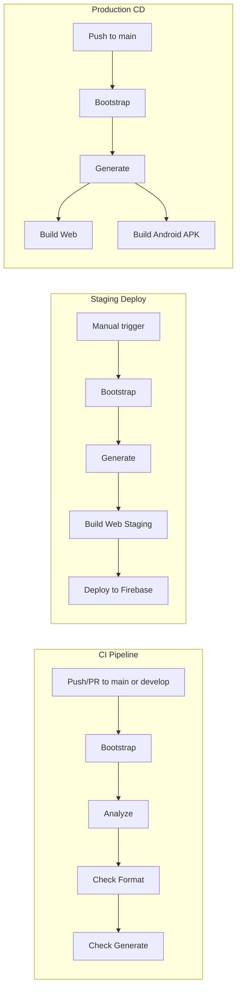

# CI/CD

The CondorCode monorepo uses **GitHub Actions** for continuous integration and continuous deployment. Workflow files are in `.github/workflows/`.

## Overview



---

## CI — Continuous Integration

**File:** `.github/workflows/ci.yml`  
**Triggers:** Push or pull request to `main` or `develop`

### Purpose

Validates code quality and consistency before changes are merged.

### Steps

| Step | Command | What it checks |
|------|---------|----------------|
| Checkout | — | Fetches the repository |
| Set up Java | — | Java 17 (Temurin) for Android builds |
| Set up Flutter | — | Flutter 3.35.0 (stable) |
| Bootstrap | `dart run melos bootstrap` | Installs and links all workspace packages |
| Run analyzer | `dart run melos run analyze` | Static analysis and lint |
| Check formatting | `dart run melos run check-format` | Code is formatted (exits with error if not) |
| Check generated code | `dart run melos run check-generate` | Generated files (e.g. `*.g.dart`) are up to date |

### Local Equivalents

Before pushing, run:

```bash
fvm dart run melos run prepush
```

This runs **generate** → **format** → **analyze**, matching CI. If `prepush` passes, CI should pass.

---

## Staging Deployment

**File:** `.github/workflows/staging.yml`  
**Trigger:** Manual (`workflow_dispatch`)

### Purpose

Builds and deploys the staging web app to the dedicated Firebase staging project. This is used for QA and internal review before releasing to production.

Staging is **not deployed automatically** — it runs only when you press the "Run workflow" button in the GitHub Actions UI. This prevents unfinished work on `develop` from accidentally reaching testers.

### Jobs

#### Build & Deploy Web Staging

| Step | Command | Output |
|------|---------|--------|
| Bootstrap | `dart run melos bootstrap` | — |
| Generate | `dart run melos run generate` | — |
| Build web (staging) | `cd apps/condor_code_app && flutter build web -t lib/main.dart --dart-define=BUILD_TYPE=staging --dart-define=DATA_SOURCE=remote` | Web build for main app |
| Deploy | `firebase deploy --only hosting --project YOUR_STAGING_PROJECT_ID` | Live staging URL |

### How to deploy staging

1. Go to **Actions → Staging Deploy** in the GitHub repository
2. Click **Run workflow**
3. Wait 5–10 minutes
4. Open the URL printed in the deploy step (e.g. `https://YOUR_STAGING_PROJECT_ID.web.app`)

### Required secret

The workflow needs a Firebase CI token to authenticate deployment:

| Secret | How to obtain |
|--------|---------------|
| `FIREBASE_TOKEN` | Run `firebase login:ci` locally and paste the token in **Repository Settings → Secrets and variables → Actions → New repository secret** |

---

## CD — Continuous Deployment

**File:** `.github/workflows/cd.yml`  
**Triggers:** Push to `main`, or manual workflow dispatch

### Purpose

Builds production artifacts for deployment (web and Android).

### Jobs

#### Build Web

| Step | Command | Output |
|------|---------|--------|
| Bootstrap | `dart run melos bootstrap` | — |
| Generate | `dart run melos run generate` | — |
| Build condor_code web | `cd apps/condor_code_app && flutter build web -t lib/main.dart --dart-define=BUILD_TYPE=prod --dart-define=DATA_SOURCE=remote` | Web build for main app |
| Build condor_code_admin web | `cd apps/condor_code_admin_app && flutter build web -t lib/main.dart --dart-define=BUILD_TYPE=prod --dart-define=DATA_SOURCE=remote` | Web build for admin app |

#### Build Android APK

| Step | Command | Output |
|------|---------|--------|
| Bootstrap | `dart run melos bootstrap` | — |
| Generate | `dart run melos run generate` | — |
| Build condor_code APK | `cd apps/condor_code_app && flutter build apk --debug` | Debug APK for main app |

Both jobs run in parallel. The admin app Android build is not included in the current workflow.

---

## Environment

- **Flutter:** 3.35.0 (stable)
- **Java:** 17 (Eclipse Temurin)
- **Runner:** `ubuntu-latest`

---

## Related

- [Working with the Monorepo](conventions/working-with-monorepo.md) — Pre-push workflow and common pitfalls
- [Git Conventions](version_control/git_conventions.md) — Commit message format and scopes
